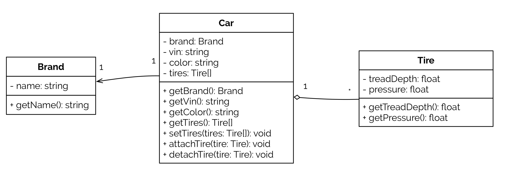

# PHP Basics: Car dealer exercises

The following repository contains possible outcome of the provided exercises:

* step-0: Hello World example
* step-1: Car domain model
* step-2: Namespaces and class files
* step-3: PSR-4 Composer refactoring
* step-4: MVC refactoring

It's possible to checkout each state locally using Git by selecting the
according step as branch name. The following example switches to `step-1`.

```
git checkout step-1
```

# Exercise for this step



**Tasks**

* model a car using the classes `Car`, `Brand` and `Tire`
* implement constructors for the required class properties
* create two different instances of a car of same brand "Mercedes" having
    * 1st: `vin=WDB12345600000001`, `color=orange`, four `Tire` instances having
		+ same properties, e.g. `treadDepth=8.0`, `pressure=3.2`
    * 2nd: `vin=WDB12345600000002`, `color=green`, four `Tire` instances having
		+ same properties, e.g. `treadDepth=5.5`, `pressure=3.1`
* for the time being, put everything in one file `index.php`

### Parts of new index.php

``` {.php .numberLines}
<?php
class Car { ... }
class Brand { ... }
class Tire { ... }
// next: create instances
```
